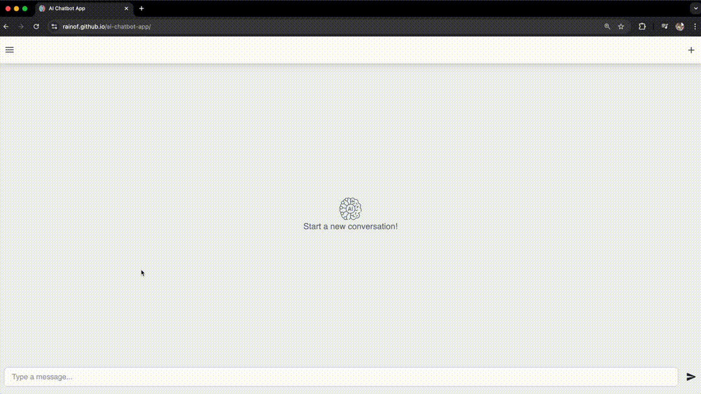

# AI Chatbot App

This project is a single-page application (SPA) with routing, combining a React frontend and a FastAPI backend. The chatbot interacts with users through natural language and performs tasks by integrating external services. The layout is fully responsive and optimized for mobile, tablet, and desktop.

## Table of Contents

- [Overview](#overview)
    - [Features](#features)
    - [Screenshot](#screenshot)
- [Getting Started](#getting-started)
- [Future Improvement](#future-improvement)

## 🌟 Overview

### Features

- AI-powered chatbot using OpenAI API

- Third-party service integration

- Persistent chat history

- Built with React and FastAPI

- SPA with client-side routing

- Responsive design for all screen sizes

- Frontend deployed via GitHub Pages

- Backend deployed on Heroku

### Screenshot

- **User interactions**

    Interactive chatbot with prompt, persistent history, and deletion feature.

    

## 🚀 Getting Started

To try the app locally or explore the code:

- **Frontend:** React app with routing, deployed via GitHub Pages

- **Backend:** FastAPI server, deployed via Heroku

You'll need Node.js and Python (3.12.4) installed, along with an OpenAI API key.

## 💡 Future Improvement

- Improve the reliability of message rendering
- Add dark theme support